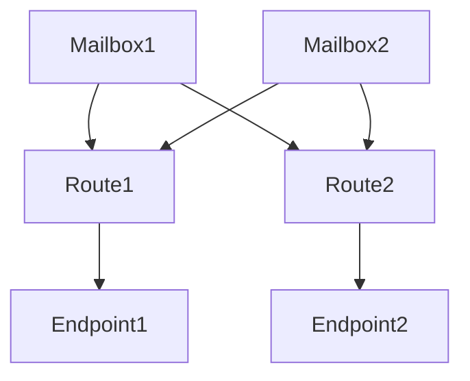

# MailWebhook Documentation
{: .fs-9 }

MailWebhook turns received email messages into deterministic JSON delivered to your backend.
{: .fs-6 .fw-300 }

{: .warning }
This project is a work-in-progress, so information on this page will update frequently.
We try to maintain backward compatibility though.

## Quick Start

### General concepts

MailWebhook operates on 3 core concepts:
- [Mailboxes]
- [Routes]
- [Endpoints]

[Mailboxes] are polled at pre-defined intervals. All ingested emails are pushed to all [Routes]. [Routes] do the matching, transform matched emails and deliver those to connected webhook [Endpoints].

### 1. Connect the mailbox.

From Dashboard or [Mailboxes] screens click "+Add Mailbox" button. Only IMAP connector is supported for now, Gmail and Outlook365 is on the way.

### 2. Connect endpoint

From Dashboard or [Endpoints] screens click "+Add Endpoint" button. No auth supported at the moment, header-based auth is coming soon.

### 3. Define route

Each email received from all configured mailboxes hit all [Routes]. Routes composed of 3 components:

1. [Rules] match incoming emails to defined set of criteria
2. [Pipeline] transform email into desired shape
3. [Endpoints] Attach route to the Endpoint.

---

[Mailboxes]: 
[Routes]: 
[Endpoints]: 
[Rules]: 
[Pipeline]: 
