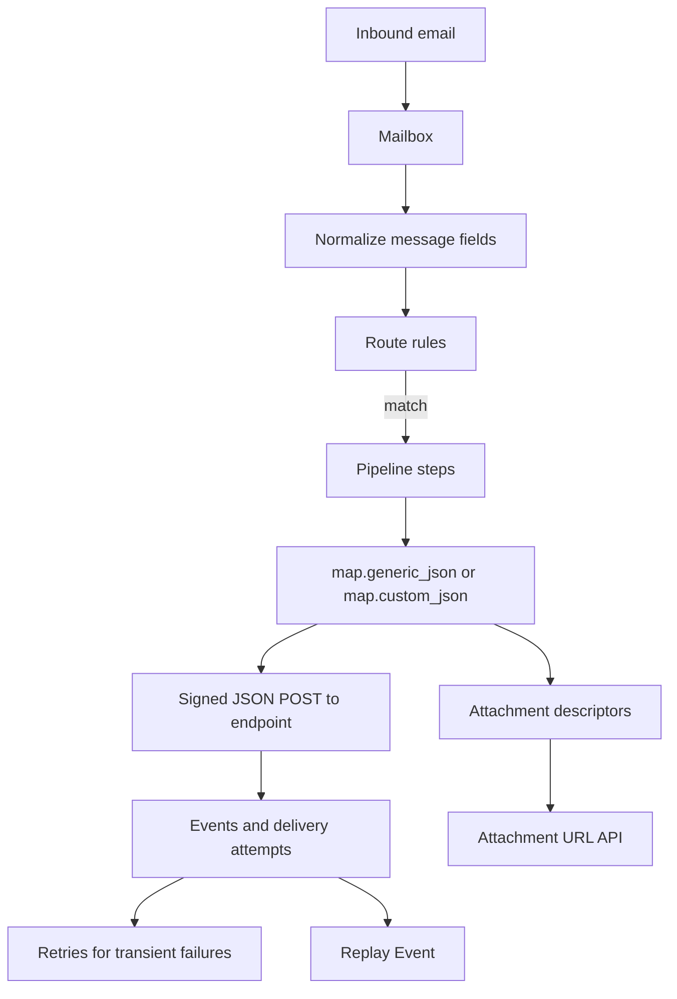

# MailWebhook Documentation
{: .fs-9 }

MailWebhook turns received email messages into deterministic JSON delivered to your backend.
{: .fs-6 .fw-300 }

{: .warning }
This project is a work-in-progress, so information on this page will update frequently.
We try to maintain backward compatibility though.

## Quick Start

### General concepts

MailWebhook operates on three core concepts:

- [Mailboxes]
- [Routes]
- [Endpoints]

[Mailboxes] receive or read email from providers such as Gmail, Microsoft 365, Office 365, Outlook, IMAP, hosted MailWebhook addresses, and loopback test addresses. Each ingested message is normalized, evaluated against [Routes], transformed by the matching route pipeline, and delivered to the route's configured [Endpoint].

The default pipeline emits [Generic JSON]. Custom pipelines can emit a different JSON body when you need a route-specific shape.

```mermaid
flowchart TD
    A[Inbound email] --> B[Mailbox]
    B --> C[Normalize message fields]
    C --> D[Route rules]
    D -->|match| E[Pipeline steps]
    E --> F[map.generic_json or map.custom_json]
    F --> G[Signed JSON POST to endpoint]
    G --> H[Events and delivery attempts]
    H --> I[Retries for transient failures]
    H --> J[Replay Event]
    F --> K[Attachment descriptors]
    K --> L[Attachment URL API]
```

### 1. Connect or create a mailbox

Open **Mailboxes** and click **+ Add Mailbox**.

Supported sources include:

- Gmail
- Microsoft 365, Office 365, and Outlook
- IMAP
- Hosted Mailbox
- Loopback test mailbox

For Gmail and Microsoft mailboxes, connect with the provider OAuth flow. For IMAP, enter the server, folder, and polling settings. New connected mailboxes start from the current mailbox cursor; use backfill when you need to ingest older messages.

### 2. Add an endpoint

Open **Endpoints** and click **+ Add Endpoint**.

An endpoint is the HTTP target that receives matched email as JSON. Configure the URL and timeout for the receiving service.

MailWebhook sends `POST` requests with `Content-Type: application/json`. Delivery requests include deterministic headers such as `X-MailWebhook-Signature` and `X-Idempotency-Key`.

### 3. Define a route

Open **Routes** and create a route that connects matching email to an endpoint.

A route has three parts:

1. [Rules] match incoming email by fields such as recipient, sender domain, subject text, or headers.
2. [Pipeline] transforms the normalized email into the webhook body.
3. [Endpoint] selects where the resulting JSON is delivered.

The default pipeline uses `map.generic_json` and emits the [Generic JSON] payload. Attachments are represented as descriptors in the payload. Your backend can request a short-lived attachment download URL through the [API keys and attachment downloads] guide with `X-API-Key`.

### 4. Send a test email

Send an email to the mailbox address or connected provider mailbox. In onboarding, use **Webhook Preview** to inspect the request, response, `curl`, Python, and Node.js examples for the delivery.

Email delivery can take 30-60 seconds depending on the sender and mailbox provider.

### 5. Monitor delivery and replay when needed

Open **Events** to inspect message status and delivery attempts. Use **Delivery Attempts History** to debug endpoint responses.

For transient failures, MailWebhook retries delivery. For manual reprocessing, open the event and use **Replay Event**.

---

[Mailboxes]: 
[Routes]: 
[Endpoints]: 
[Endpoint]: 
[Rules]: 
[Pipeline]: 
[Generic JSON]: 
[API keys and attachment downloads]: 
